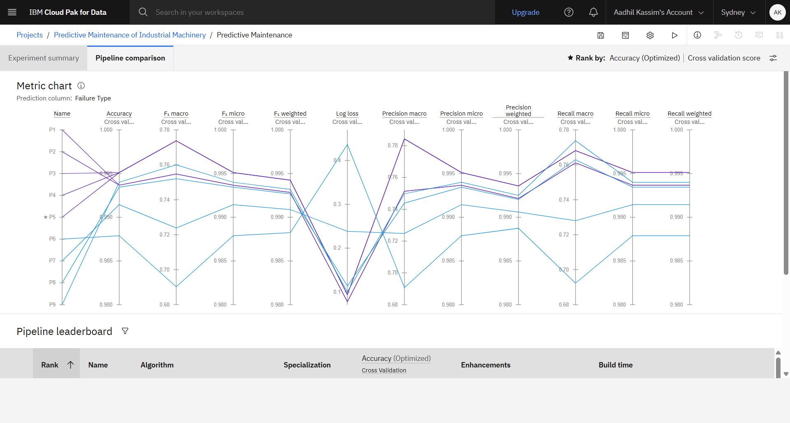
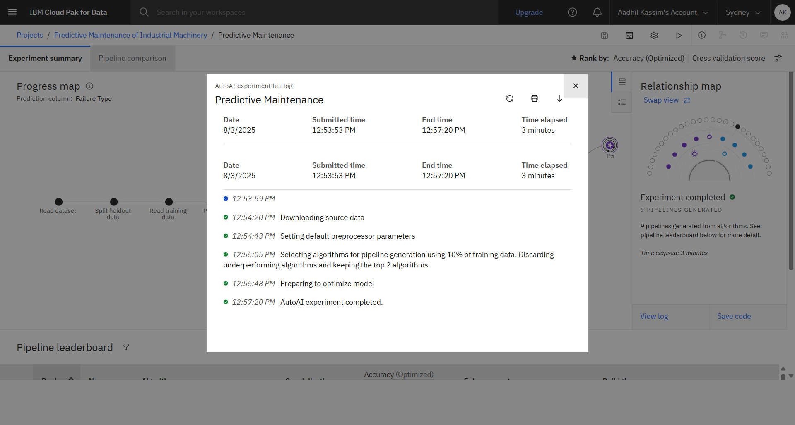
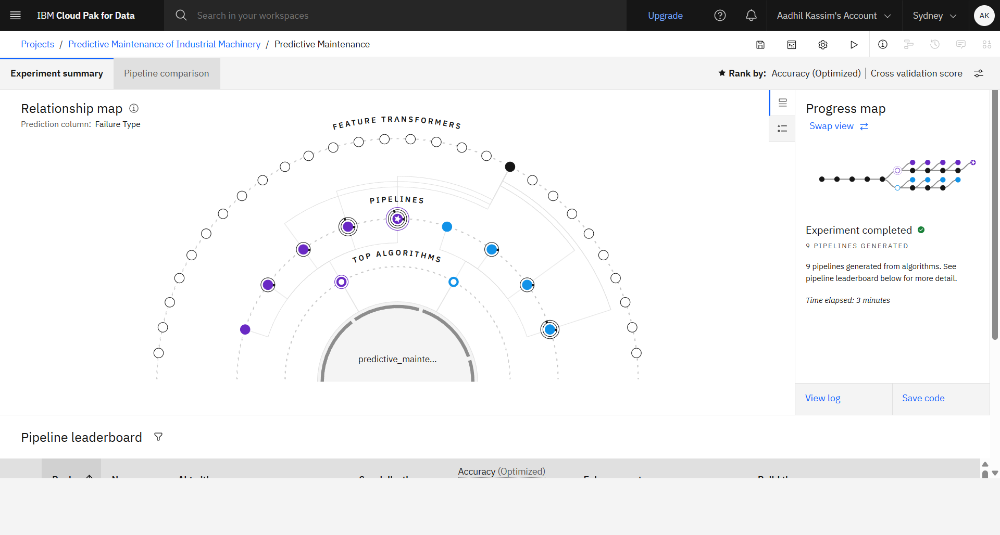
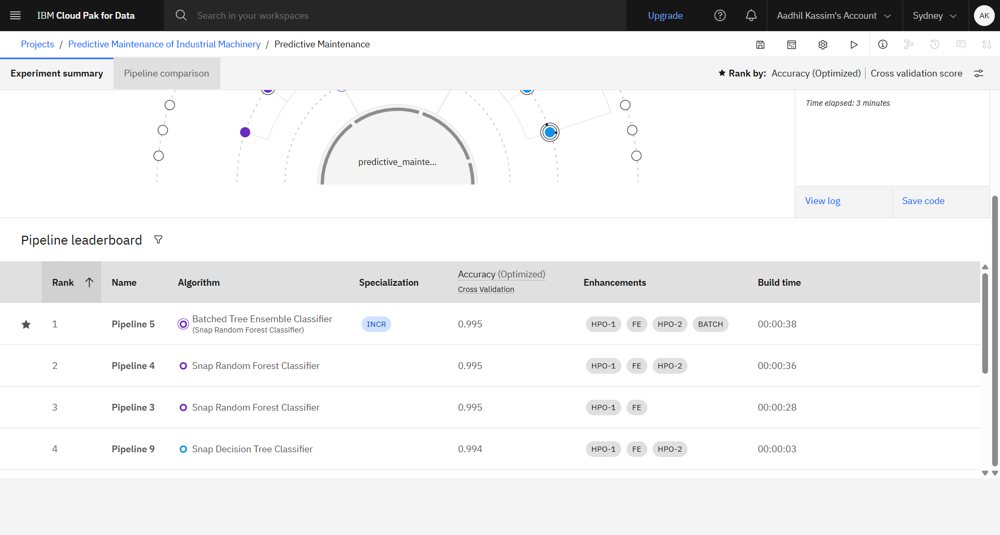

# Predictive Maintenance of Industrial Machinery

## Problem Statement

Develop a predictive maintenance model for a fleet of industrial machines to anticipate failures before they occur. The project analyzes sensor data from machinery to identify patterns that precede a failure. The goal is to build a classification model that predicts the type of failure (e.g., tool wear, heat dissipation, power failure) using real-time operational data. This enables proactive maintenance, reducing downtime and operational costs.

## Dataset

- **Source:** [Kaggle - Machine Predictive Maintenance Classification](https://www.kaggle.com/datasets/shivamb/machine-predictive-maintenance-classification)
- The dataset contains sensor readings and failure types for industrial machines.

## Technology Stack

- **IBM Cloud Lite Services**
  - WatsonX AI (AutoAI, Model Deployment)
  - IBM Cloud Object Storage
  - IBM Cloud Runtime
- **Python 3.11**
- **scikit-learn 1.3**
- **snapml**
- **lale**
- **autoai-libs**

## Approach

- Used IBM WatsonX AutoAI to automate model selection, hyperparameter optimization, and feature engineering.
- Trained multiple pipelines including Snap Random Forest Classifier and Batched Tree Ensemble Classifier.
- Evaluated models using cross-validation and accuracy metrics.
- Deployed the best-performing model using IBM Cloud deployment spaces.

## Results

- Achieved high accuracy (up to 0.995) in predicting failure types.
- Experiment generated 9 pipelines; top pipelines used ensemble methods for improved performance.
- Visualizations and leaderboard screenshots are included below for reference.

### Experiment Screenshots

#### Pipeline Comparison & Metrics

#### Experiment Progress & Log

#### Relationship Map & Leaderboard

## Credentials

- **Project Owner:** Aadhil Kassim
- **IBM Cloud Region:** Sydney (au-syd)
- **Project ID:** e2bba5a6-b03f-41bb-bfed-8207ab23f7f2
- **Deployment Space ID:** 6bdf9541-e71f-48cf-9818-6cb9130dddc6

## How to Run

1. Clone this repository.
2. Open the notebook `_P5 - Snap Random Forest Classifier_ Predictive_FINAL_PROJECT.ipynb`.
3. Follow the setup instructions to install required packages and configure IBM Cloud credentials.
4. Run the notebook cells to train, evaluate, and deploy the predictive maintenance model.

## References

- [IBM Watson Studio AutoAI Documentation](https://dataplatform.cloud.ibm.com/docs/content/wsj/analyze-data/autoai-notebook.html)
- [Kaggle Dataset](https://www.kaggle.com/datasets/shivamb/machine-predictive-maintenance-classification)

---

Licensed Materials - Copyright © 2025 IBM.
